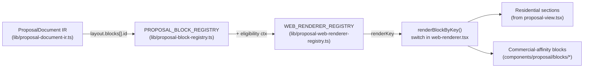
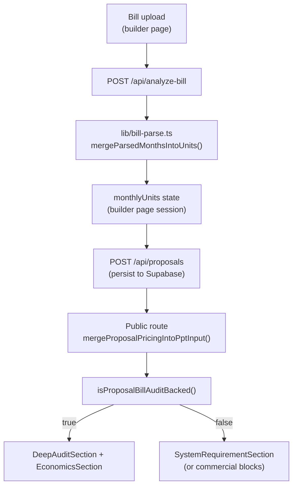

# 08 — Proposal Flow Preservation & Dependency Map

> Read-only inspection. **This is the most critical document in the audit pack.** It maps what the proposal system depends on so the redesign does not silently break PDF/PPT generation, public proposal rendering, or the residential bill flow.

## 1. The two parallel proposal flows

SOL.52 supports two preset-driven flows. The route differentiation happens at the public proposal page.

```mermaid
flowchart LR
  start([User clicks "Generate Web Proposal"]) --> builder["/proposal builder page<br/>(app/main/proposal/page.tsx, 2413 lines)"]
  builder -->|POST /api/proposals| store[(Supabase: proposals<br/>+ proposal_pricing<br/>+ pricing snapshots)]
  store --> publicRoute["/proposal/[id]<br/>(public route, 88 lines)"]
  publicRoute -->|preset_id === commercial_executive| commercialView["CommercialProposalView<br/>(components/proposal/commercial-proposal-view.tsx)"]
  publicRoute -->|otherwise| residentialView["ProposalView<br/>(app/public/proposal/[id]/proposal-view.tsx, 2622 lines)"]
  residentialView -.->|exports 17 sections to| webRenderer["ProposalWebRenderer<br/>(components/proposal/web-renderer.tsx)"]
  commercialView --> commercialBlocks["10 commercial blocks<br/>(components/proposal/blocks/commercial/*)"]
```

Two distinguishing facts:

1. **The public commercial route does NOT use `ProposalWebRenderer`.** It calls `CommercialProposalView` directly. The renderer is wired but unused for commercial.
2. **`ProposalWebRenderer` imports residential section components directly from `proposal-view.tsx`** (see `web-renderer.tsx` lines 55–71). This is the single hard coupling.

## 2. The 2,622-line residential view exports 17 sections

```272:2338:app/(public)/proposal/[id]/proposal-view.tsx
export function StatTile(...) { ... }
export function SectionHeader(...) { ... }
export function HeroCover(...) { ... }                  // ← imported by web-renderer
export function SystemRequirementSection(...) { ... }   // ← imported by web-renderer
export function DeepAuditSection(...) { ... }           // ← imported by web-renderer
export function EconomicsSection(...) { ... }           // ← imported by web-renderer
export function EnvironmentSection(...) { ... }         // ← imported by web-renderer
export function CompanyProfileSection(...) { ... }      // ← imported by web-renderer
export function TechnicalProposalSection(...) { ... }   // ← imported by web-renderer
export function BomSection(...) { ... }                 // ← imported by web-renderer
export function PaymentSection(...) { ... }             // ← imported by web-renderer
export function CommercialAndAmcSection(...) { ... }    // ← imported by web-renderer
export function ServiceAmcSection(...) { ... }          // ← imported by web-renderer
export function BankingSection(...) { ... }             // ← imported by web-renderer
export function SurveyAndWorkflowSection(...) { ... }   // ← imported by web-renderer
export function ClosingSection(...) { ... }             // ← imported by web-renderer
```

`web-renderer.tsx` (lines 55–71) re-imports these:

```55:71:components/proposal/web-renderer.tsx
import {
  HeroCover,
  CompanyProfileSection,
  DeepAuditSection,
  EconomicsSection,
  SystemRequirementSection,
  EnvironmentSection,
  TechnicalProposalSection,
  BomSection,
  SurveyAndWorkflowSection,
  ServiceAmcSection,
  PaymentSection,
  CommercialAndAmcSection,
  BankingSection,
  ClosingSection,
} from "@/app/(public)/proposal/[id]/proposal-view";
```

This means: **`proposal-view.tsx` is BOTH the residential public view AND the residential section library** for the web renderer. Splitting them is the highest-risk refactor in the codebase.

## 3. Block → Render-key → Component dispatch



**Eligibility rules** (from `proposal-web-renderer-registry.ts` lines 66–69):

- `billBacked` — only when bill data is present.
- `noBill` — only when bill is absent OR commercial preset.
- `commercialOnly` — only when `presetId === "commercial_executive"`.
- `surveyOnly` — only when CRM marks site survey complete.

These eligibility predicates are the safety net that determines what renders.

## 4. Critical file inventory

### 4.1 Files that MUST keep their public API stable

| File | What relies on it | Why it cannot break |
|---|---|---|
| `app/(public)/proposal/[id]/proposal-view.tsx` | `web-renderer.tsx` (imports 14 sections), `app/(public)/proposal/[id]/page.tsx` (default export) | All residential public proposals; renderer dispatch |
| `app/(public)/proposal/[id]/page.tsx` | Customer-facing `/proposal/[id]` URLs | The public route — accessed by every shared proposal link |
| `components/proposal/web-renderer.tsx` | Used internally by commercial flow (and any future preset that opts in) | Block-loop engine |
| `components/proposal/commercial-proposal-view.tsx` | `app/(public)/proposal/[id]/page.tsx` conditional import | Commercial public proposal rendering |
| `components/proposal/blocks/*` (4 residential + 10 commercial) | Renderer + commercial view direct imports | Block-level rendering |
| `lib/proposal-document-ir.ts` | Engine compilation | Canonical IR shape |
| `lib/proposal-web-renderer-registry.ts` | `web-renderer.tsx` | Dispatch table |
| `lib/proposal-block-registry.ts` | All preset definitions | Block ID enum |
| `lib/proposal-preset-engine.ts` | Builder preset picker, IR compilation | Preset → layout mapping |
| `lib/proposal-snapshot-store.ts` | Pricing immutability | Audit history |
| `lib/proposal-approval-events.ts` | Approval/event log | Future activity feed surface |
| `lib/proposal-ppt.ts::summarizeProposalDeck`, `PremiumProposalPptInput` | All blocks consume the summary derived from this | The single source of truth that hydrates every block |
| `lib/proposal-pricing-merge.ts::mergeProposalPricingIntoPptInput` | Public route hydration (line 23 of page.tsx) | Live pricing overlay |
| `lib/proposal-bill-audit-eligibility.ts::isProposalBillAuditBacked` | Block eligibility | Determines bill vs requirement path |
| `lib/proposals-store.ts` | All proposal CRUD APIs | Supabase persistence |
| `lib/proposal-pricing-store.ts` | Pricing CRUD | Persistence |
| `lib/proposal-template-schema.ts::ProposalTemplateV1` | Preset engine, builder block playlist | Schema for block order/enable |
| `lib/proposal-i18n.ts::dict`, `monthLabels` | Every block + view | Hindi/English strings |
| `lib/proposal-deck-helpers.ts::profileFieldOrDash`, `EmiRow` | Multiple blocks | Field formatting |
| `lib/proposal-company-resolve.ts::resolvedCompanyProfileForLang` | About-company section | Installer profile |
| `lib/proposal-branding-settings.ts::readProposalBrandingSettings`, `PROPOSAL_BRANDING_UPDATED_EVENT` | Renderer, builder, view | Local branding sync |
| `lib/roman-name-to-devanagari.ts::hindiHonoredDisplayName` | Hindi name rendering | Honorifics in Hindi |
| `lib/proposal-web-theme.ts::readProposalWebTheme`, `writeProposalWebTheme`, `applyProposalRouteShellTheme` | Renderer dark mode | Theme persistence |
| `lib/platform-branding.ts::PROPOSAL_PLATFORM_CREDIT` | Closing section credit | Brand line |

### 4.2 API routes that must not change shape

| Route | Consumers |
|---|---|
| `POST /api/proposals` | Builder save (page.tsx line 1248) |
| `GET /api/proposals/[id]` | Hub + manage client |
| `POST /api/proposal-ppt` | PPT export (line 1156) |
| `GET /api/proposals/[id]/ppt?lang=...` | Renderer PPT download (`downloadPpt` in `web-renderer.tsx`) |
| `GET /api/proposals/[id]/pricing` | Public route hydration |
| `GET /api/proposals/[id]/layout` | Block playlist load |
| `GET /api/pipeline` | Projects page |
| `GET /api/dashboard-stats` | Dashboard |
| `GET /api/customers` | Customers page + builder |
| `POST /api/analyze-bill` | Bill parsing in builder |

### 4.3 Persistent storage keys

```58:60:app/(main)/proposal/page.tsx
const CLIENT_REF_STORAGE_KEY = "ss_device_ref";
const LEARNED_BILL_PROFILE_KEY = "ss_bill_upload_profile_v1";
const SESSION_STATE_KEY = "ss_proposal_session_v2";
```

These three keys hold device identity, the user's learned bill-upload preferences per state/discom, and the in-progress proposal session. **Any redesign that re-mounts the builder page must preserve these.** A version bump (e.g. `_v3`) requires a migration path.

Additionally, the proposal web theme uses its own key set in `lib/proposal-web-theme.ts` (`readProposalWebTheme`/`writeProposalWebTheme`). Branding settings use `PROPOSAL_BRANDING_UPDATED_EVENT` to sync across tabs.

## 5. Bill-upload flow preservation

The bill flow is the most fragile vertical because it spans:

1. UI: bill drop-zone in builder → manual entry fallback → multi-bill upload (`additionalBills`).
2. Parsing: `POST /api/analyze-bill` → `lib/bill-parse.ts` → AI extraction.
3. Tariff: `lib/tariff-engine.ts` + `lib/mp-tariff-2025-26.ts` + `lib/discom-billing-rules.ts`.
4. Engine: `lib/solar-engine.ts::calculateSolar`.
5. Eligibility: `lib/proposal-bill-audit-eligibility.ts::isProposalBillAuditBacked` decides if `DeepAuditSection` renders or `SystemRequirementSection` renders.
6. Renderer dispatch: `WEB_RENDERER_REGISTRY` uses `billBacked` / `noBill` predicates to pick blocks.



**Preservation rules:**

- Do NOT change the shape of `ParsedBillShape`, `MonthlyUnits`, or `PremiumProposalPptInput`.
- Do NOT change the predicate logic of `isProposalBillAuditBacked()` — the entire bill-vs-requirement dispatch hinges on it.
- Do NOT change the eligibility predicates in `proposal-web-renderer-registry.ts` without verifying every block continues to render in both paths.

## 6. Block ID dependencies (data model)

```typescript
// lib/proposal-block-registry.ts
export const PROPOSAL_BLOCK_IDS = [
  "cover_page",
  "about_company",
  "executive_summary",
  "technical_proposal",
  "system_requirements",
  "technical_specifications",
  "bom_material_list",
  "financial_summary",
  "roi_savings",
  "payback_analysis",
  "warranty",
  "payment_terms",
  "terms_conditions",
  "project_gallery",
  "customer_documents_required",
  "amc_maintenance",
] as const;
```

These 16 block IDs are persisted into the `proposal_layout` table (likely jsonb). **The IDs themselves are part of the data contract** — renaming or removing one would invalidate stored proposals.

Adding new block IDs (e.g. `case_study`, `financing_plan`, `multi_contact_directory` for E7 preset expansion) is **safe**, provided:

1. The new ID is added to `PROPOSAL_BLOCK_IDS` const.
2. `PROPOSAL_BLOCK_REGISTRY` gets the metadata entry.
3. `WEB_RENDERER_REGISTRY` gets the dispatch entry (or the block ID is left unregistered for now, in which case it is skipped — see `getEnabledProposalBlocksInOrder` and the `renderedKeys` Set in `web-renderer.tsx` line 445).
4. Existing proposals' stored layouts (which won't contain the new ID) continue to render unchanged.

## 7. What feels disconnected today (proposal-side)

- **Builder and public view are two different visual languages** (busy form vs cinematic deck). The "wow" moment happens too late in the user's mental flow — they have to save and open the public link to see the result.
- **Live Preview Panel** tries to bridge this gap on the builder, but it activates only at `lg:` and renders a mini version. The visual delta is large.
- **The Hub workspace preview** also tries to bridge the gap with a mini snapshot, but uses different chrome than the actual proposal.

## 8. Files that already feel premium (preserve)

- `components/proposal/web-renderer.tsx` — block-loop engine is well-architected.
- `lib/proposal-web-renderer-registry.ts` — clean dispatch table with eligibility predicates.
- `lib/proposal-block-registry.ts` — clean enum + metadata.
- `lib/proposal-preset-engine.ts` — extensible preset registry, already shaped for E7 expansion.
- `lib/proposal-document-ir.ts` — IR + compiler abstraction.
- `lib/proposal-snapshot-store.ts` — immutable pricing snapshots.
- `lib/proposal-approval-events.ts` — append-only event log.
- The 10 commercial blocks + `commercial-shared.tsx` (the visual benchmark).

## 9. Preservation summary — "do not remove" list

This is a draft for `09-premium-preservation.md`. Items marked here are non-negotiable for the proposal flow:

- All exports from `proposal-view.tsx` (HeroCover through ClosingSection).
- Storage keys `ss_device_ref`, `ss_bill_upload_profile_v1`, `ss_proposal_session_v2`.
- All API routes under `/api/proposals/*` and `/api/proposal-ppt`.
- The block ID enum (16 entries).
- `WEB_RENDERER_REGISTRY` eligibility predicate set.
- The `MotionConfig reducedMotion="user"` wrapper on the renderer.
- A4-locked residential proposal width (`max-w-[210mm]`).
- `useBlockCountUp` print-safe behavior.
- `JourneyBridge` text bridges (residential narrative).
- `proposal-pricing-snapshots` table.
- `proposal_approval_events` table.

## 10. Recommended deltas for E1+ (input)

1. **Extract `proposal-view.tsx` sections into individual files** during E5, NOT before E1. The unified primitives must land first so the extracted sections can adopt them in the same PR.
2. **Migrate `web-renderer.tsx` imports** to the new section file paths in the same PR as the extraction. This is the moment of highest risk — schedule a single unbroken session with both Opus design review and Sonnet implementation.
3. **Add storage key versioning** before E5: read old key, migrate to new key, write new key. This guarantees in-progress sessions survive the builder redesign.
4. **Lock the block ID enum** with a unit test in `lib/__tests__/` that snapshots the array order. Any future PR that mutates the array fails the test, forcing a deliberate migration.
5. **Lock the eligibility predicate signatures** in `proposal-web-renderer-registry.ts` with a TypeScript type guard so future presets must add eligibility explicitly (not silently fall through).
6. **Do NOT** touch the residential public proposal sections during E1. Their internal organization is unrelated to the token consolidation work.
