# 10 — Disconnection Map (Overloaded Systems, Inconsistent Screens, Disconnected Modules)

> Read-only inspection. This is the "where the seams show" document — the diagnostic counterpart to `09-premium-preservation.md`.

## 1. Three god-files

| File | Lines | What's wrong | Risk of touching naively |
|---|---:|---|---|
| `app/(public)/proposal/[id]/proposal-view.tsx` | 2,622 | Holds 17 exported sections re-imported by the renderer. Single hardest dependency in the app. | Splitting it without a plan breaks every residential public proposal AND the commercial renderer's bill-audit / economics / about / banking / closing sections. |
| `app/(main)/proposal/page.tsx` | 2,413 | Mixes form state, SWR fetches, sessionStorage, bill parsing, manual customer state, multi-bill upload, Proposal OS chrome, preset state, AI dispatch, save endpoints. | Re-mounting causes session loss. Splitting state engines causes race conditions. |
| `app/globals.css` | 3,427 | 98 root-level utility classes (workspace, proposal pages, glass variants, status pills, page-break rules). | Removing a class silently breaks production. Renaming a class silently breaks print/PDF. |

**Reading order rule:** Any change to these three files in E1–E12 must be accompanied by a fresh re-read of the file and a documented diff in the PR.

## 2. Overloaded systems

### 2.1 The Proposal Builder page (`(main)/proposal/page.tsx`)

The builder is doing the work of 6 distinct concerns:

1. Customer form (manual + linked lead).
2. Bill upload (primary + multi-bill + parsed bill state).
3. Tariff context (state + discom + tariff overrides).
4. Solar engine inputs (sizing overrides, panels override).
5. Proposal OS chrome (preset picker, stage bar, live preview, playlist editor).
6. Pipeline persistence (save proposal + bump lead + sync pipeline + clear session).

This is too much for one route file. Phase E5 (Workspace three-pane upgrade) should split the responsibilities into:

- `BuilderFormState` (form fields + manual customer).
- `BuilderBillFlow` (bill upload + parse + audit eligibility).
- `BuilderPresetState` (preset picker + block playlist).
- `BuilderPersistence` (save + clear session + pipeline mutation).

Each as a hook (`useBuilderForm`, `useBuilderBills`, etc.), driven by one orchestrator `useProposalBuilder()` that exposes a stable API to the page.

### 2.2 `globals.css`

3,427 lines of CSS. 98 root-level utility classes. 12 print/break rules. Several conceptually-distinct themes live here:

- shadcn HSL tokens (light + dark).
- `.mesh-gradient-bg` workspace backdrop.
- `.workspace-page-*` family.
- `.ss-*` family (cards, steps, status pills, buttons).
- `.glass-*` family (premium, quiet, hero-cta).
- `.proposal-*` family (page, document, journey-connected, responsive-doc).
- `.ws-*` family (icon wells, type-eyebrow, type-greeting, etc.).
- `.app-chrome-*` family (header, bottom-nav).
- `.ss-skeleton-shimmer`, `.ss-toast-pop` animations.

The file is **functional but unsplittable** at this stage because every utility class is referenced from somewhere. E1 must token-ize incrementally, NOT rewrite the file.

### 2.3 `proposal-view.tsx`

17 exported section components + many internal helpers + the default export. The renderer relies on the named exports. Splitting will require:

1. Move each section to `components/proposal/sections/{section-name}.tsx`.
2. Update `web-renderer.tsx` imports.
3. Keep the default export wrapper in place during transition.
4. Test print output identical to baseline.

E5 deliverable, NOT E1.

### 2.4 `lib/proposal-*.ts` count (37 files)

37 lib files prefixed `proposal-` is healthy modularity, NOT overload. But there is some redundancy:

- `proposal-block-registry.ts` appears twice in Glob results (Windows path duplication, likely one canonical file).
- `proposal-i18n.ts` and `lib/proposal-i18n.ts` likewise.
- `proposal-pricing-{lines, merge, schema, store, sync}.ts` is 5 pricing files — could plausibly be `lib/proposal-pricing/` subfolder.
- `proposal-hub-{dedupe, insights, share}.ts` is 3 hub-helpers — could plausibly be `lib/proposal-hub/` subfolder.

This is not "broken," it is "could be tidier" — schedule as a low-priority refactor during E1 if time permits.

## 3. Inconsistent screens

### 3.1 The visual-language fault line

Five dialects in one app (detailed in `07-visual-consistency.md` §3.1):

1. Dashboard / Workspace dialect (premium pastel)
2. Public residential proposal dialect (print-first)
3. Public commercial proposal dialect (dark deck)
4. Builder form dialect (Floating-label inputs + dense state)
5. Admin dialect (unstyled)

User journey for a sales rep using SOL.52:

```
Dashboard (dialect 1) → Proposals Hub (dialect 1) → Open Workspace (dialect 1)
                                                            ↓
                                                  Builder (dialect 4) ← feels different
                                                            ↓
                                                  Generate Web Proposal
                                                            ↓
                                                  Public link (dialect 2 or 3) ← feels VERY different
```

There are two transitions in this journey that feel jarring. The audit confirms this.

### 3.2 Specific inconsistencies

| Surface A | Surface B | Inconsistency |
|---|---|---|
| Builder step cards | Hub deal cards | Different rhythm, different padding, different elevation |
| Hub deal card status pill | Public proposal status badge | Two different status pill implementations |
| Hub workspace preview | Actual public proposal | The preview promises a layout the real proposal doesn't deliver (preview is mini, actual is full) |
| Dashboard `MetricCard` | Commercial `KpiCard` | Same idea, different families. A user toggling between Dashboard and a commercial proposal feels the discontinuity. |
| Customer lead card | Project pipeline card | Two visual languages for "person/thing with state" |
| Workspace hero (tone gradient) | Commercial proposal cover (dark) | Tone gradient is light/soft, cover is dark/heavy — intentional but currently jarring without a "you are entering a presentation mode" transition. |
| Floating-label inputs across pages | shadcn Inputs in shadcn `Card` | Two input languages |

## 4. Disconnected modules

A module feels "disconnected" when the user has to mentally re-locate themselves after navigating to it.

### 4.1 Customer → Proposal

Today's flow: Customer detail → click "create proposal" → land on `/proposal` with `?leadId=...`. Then the form loads pre-populated. **But:**

- No visual breadcrumb shows "you came from customer X."
- No persistent indicator of which customer this proposal will belong to.
- The lead-link is implicit (in `selectedLeadId` state, not in chrome).

### 4.2 Proposal → Project

Today's flow: Generate web proposal → click save → behind the scenes, a pipeline project is created (`POST /api/proposals` triggers pipeline project upsert per `(main)/proposal/page.tsx` line 1085 comment). **But:**

- No UI confirmation showing "Project P-1234 created."
- No link to jump to the new project.
- The relationship Customer-Proposal-Project is only visible by navigating each module separately.

### 4.3 Proposal Hub → Proposal Builder

Today's flow: Hub → click "+ New" → land on `/proposal` with a fresh session. **But:**

- The Hub right pane (workspace preview) is shown for selected proposals — but creating a new one jumps to a completely separate page (`/proposal` not `/proposals/new`).
- No animation continuity.

### 4.4 Dashboard → Hub → Builder → Public

Dashboard shows aggregate KPIs. Hub shows pipeline. Builder is data entry. Public is the artefact. Each module FEELS like a separate product. There is no continuous "deal" entity that travels with the user.

The roadmap calls for an "Active Workspace Pill" that floats across routes, showing the currently-focused deal. That's exactly the right fix — schedule in E2 (universal shell) and E9 (module connectivity).

### 4.5 Approval events log → Anywhere

`proposal_approval_events` table exists. `appendApprovalEvent()` is called somewhere. **No UI surface today displays this event stream.** The data is being captured but is invisible to the user. Schedule in E9 (activity feed) and E12 (collaboration).

### 4.6 Pricing snapshots → Anywhere

`proposal_pricing_snapshots` table exists. Snapshots are appended on price changes. **No UI surface today shows the snapshot history.** Same situation as approval events. Schedule in E9 / E12.

### 4.7 Performance mode → Anywhere

`data-ss-perf-mode` attribute is consumed only by `MetricCard`. There is no UI to set it. **Probably a dead capability.** Decide in E1 whether to expand consumption or retire.

### 4.8 Workflow lifecycle strip → Detail screens

`WorkflowLifecycleStrip` shows on Customers, Projects, Proposals workspace headers. It's the closest thing to a cross-module status indicator. But it does NOT show:

- Where the customer is right now.
- What the next action is.
- Who owns the next action.

It's a static visualization, not an interactive timeline. E4 (Mission Control strip) should evolve it.

## 5. Coupling that should worry us

### 5.1 `web-renderer.tsx` imports from `proposal-view.tsx`

```55:71:components/proposal/web-renderer.tsx
import {
  HeroCover,
  /* ... 13 more ... */
} from "@/app/(public)/proposal/[id]/proposal-view";
```

This means the commercial renderer (and any future preset that opts into the WebRenderer dispatch) **transitively depends on the residential public route file**. Moving `proposal-view.tsx` requires updating these imports. Reverting `proposal-view.tsx` to a non-export shape would silently break the renderer.

**Mitigation:** the extraction in E5 must be atomic with the import-path migration.

### 5.2 Builder page → sessionStorage keys → builder page

The builder page reads its own keys to hydrate session on mount. If a future redesign re-mounts the page (e.g. wrapped in a route transition layout), the keys remain compatible BUT the mount/unmount cycle changes timing of the `loadSession()` call. Re-mount during transition can cause the form to "reset" mid-edit.

**Mitigation:** during E5, switch from synchronous `useMemo(loadSession)` to a `useSyncExternalStore` pattern that survives transition.

### 5.3 `proposal-view.tsx` reading `PROPOSAL_BRANDING_UPDATED_EVENT`

```361:362:components/proposal/web-renderer.tsx
window.addEventListener(PROPOSAL_BRANDING_UPDATED_EVENT, sync);
return () => window.removeEventListener(PROPOSAL_BRANDING_UPDATED_EVENT, sync);
```

The renderer subscribes to a global `window` event. If multiple proposal tabs are open and one updates branding, all sync. **Premium behavior — preserve.** But: any redesign that introduces a worker, service worker bridge, or new tab management must not break this event.

### 5.4 `MetricCard` reading `data-ss-perf-mode` directly from `document.documentElement`

```62:63:components/metric-card.tsx
const perfMode = document.documentElement.getAttribute("data-ss-perf-mode");
```

Direct DOM read. Not via context. If a redesign introduces app-wide context for performance mode, `MetricCard` must be updated to consume it (otherwise it silently keeps reading from `document.documentElement`, which may be unset in the new model).

## 6. Recommended deltas for E1+ (input)

1. **Lock the god-files** with a mention in `09-premium-preservation.md` (already done).
2. **Stage the extraction of `proposal-view.tsx`** for E5, NOT E1.
3. **Stage the disentangling of `(main)/proposal/page.tsx`** for E5, NOT E1.
4. **During E1, do NOT touch the god-files at all.** Token consolidation must happen in primitive libraries first, then progressively adopted by god-files.
5. **Add an "active deal pill"** in E2 (universal shell) to thread Customer-Proposal-Project across routes.
6. **Surface `proposal_approval_events`** in E9 (module connectivity) — turn data into a visible activity timeline.
7. **Surface `proposal_pricing_snapshots`** in E9 / E12 — turn snapshot history into a visible version timeline.
8. **Replace `MetricCard`'s direct `data-ss-perf-mode` read** with a context consumer during E1.
9. **Add a "creating proposal for {customer.name}" chip** to the builder page top during E5.
10. **Add a "proposal saved → project created" toast with a deep link** during E5 / E9.

## 7. The dependency map (one diagram)

```mermaid
flowchart TB
  subgraph CHROME["App Chrome"]
    appShell["app-shell.tsx"]
    bottomNav["bottom-nav.tsx"]
    topNav["desktop-top-nav.tsx"]
  end

  subgraph DASH["Dashboard"]
    dashPage["app/(main)/page.tsx"]
    cmd["DashboardCommandCenter"]
    ops["DashboardOperationalInsights"]
    qa["DashboardQuickActions"]
    metric["MetricCard"]
  end

  subgraph HUB["Proposals Hub"]
    hubPage["app/(main)/proposals/page.tsx"]
    hubList["ProposalHubDealList"]
    hubPreview["ProposalWorkspacePreview"]
    hubIntel["ProposalHubIntelPanel"]
    hubStrip["ProposalHubAnalyticsStrip"]
  end

  subgraph BUILDER["Builder"]
    builderPage["app/(main)/proposal/page.tsx"]
    presetPicker["ProposalPresetPicker"]
    stageBar["BuilderStageBar"]
    livePreview["ProposalLivePreviewPanel"]
    playlist["BlockPlaylistEditor"]
    osHeader["ProposalOSHeader"]
  end

  subgraph RENDER["Public Renderers"]
    publicRoute["app/(public)/proposal/[id]/page.tsx"]
    resView["proposal-view.tsx (god-file)"]
    commView["commercial-proposal-view.tsx"]
    webRenderer["web-renderer.tsx"]
  end

  subgraph ENGINE["Proposal Engine (lib)"]
    ir["proposal-document-ir.ts"]
    presets["proposal-preset-engine.ts"]
    blocks["proposal-block-registry.ts"]
    registry["proposal-web-renderer-registry.ts"]
    summary["proposal-ppt.ts"]
    bill["bill-parse.ts + tariff-engine.ts"]
    solar["solar-engine.ts"]
    snap["proposal-snapshot-store.ts"]
    events["proposal-approval-events.ts"]
  end

  subgraph DATA["Supabase"]
    tProposals[("proposals")]
    tPricing[("proposal_pricing")]
    tSnap[("proposal_pricing_snapshots")]
    tEvents[("proposal_approval_events")]
    tLeads[("leads")]
    tPipeline[("pipeline projects")]
  end

  dashPage --> cmd
  dashPage --> ops
  dashPage --> qa
  cmd --> metric

  hubPage --> hubList
  hubPage --> hubPreview
  hubPage --> hubIntel
  hubPage --> hubStrip

  builderPage --> presetPicker
  builderPage --> stageBar
  builderPage --> livePreview
  builderPage --> playlist
  builderPage --> osHeader
  builderPage --> bill
  builderPage --> solar

  builderPage -->|POST /api/proposals| tProposals
  builderPage -->|writes| tPricing
  tPricing --> tSnap
  builderPage -->|emits| tEvents

  publicRoute --> resView
  publicRoute --> commView
  commView --> webRenderer
  webRenderer -.->|imports 14 sections| resView
  webRenderer --> registry
  webRenderer --> ir

  registry --> blocks
  presets --> blocks
  ir --> summary

  hubList -->|GET| tProposals
  hubPreview -->|GET| tProposals
  appShell --> bottomNav
  appShell --> topNav
```



**The thick coupling** (`webRenderer -.->|imports 14 sections| resView`) is the single most important relationship to preserve. Every other arrow can be redesigned with care; that one must be honored.
